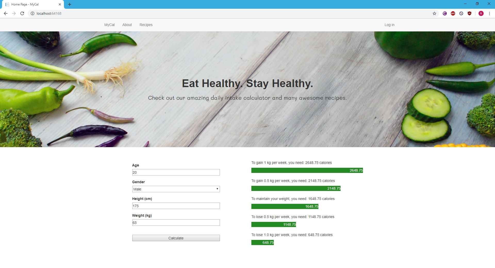
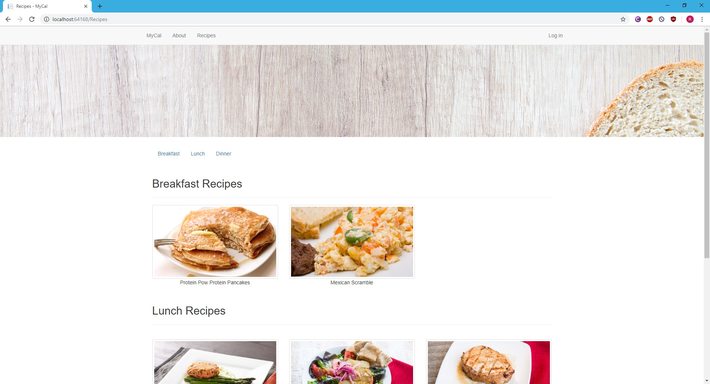
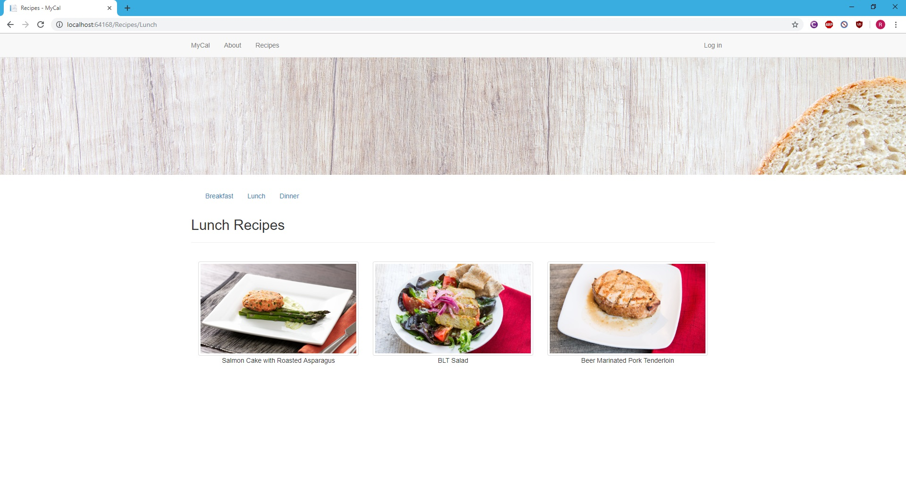
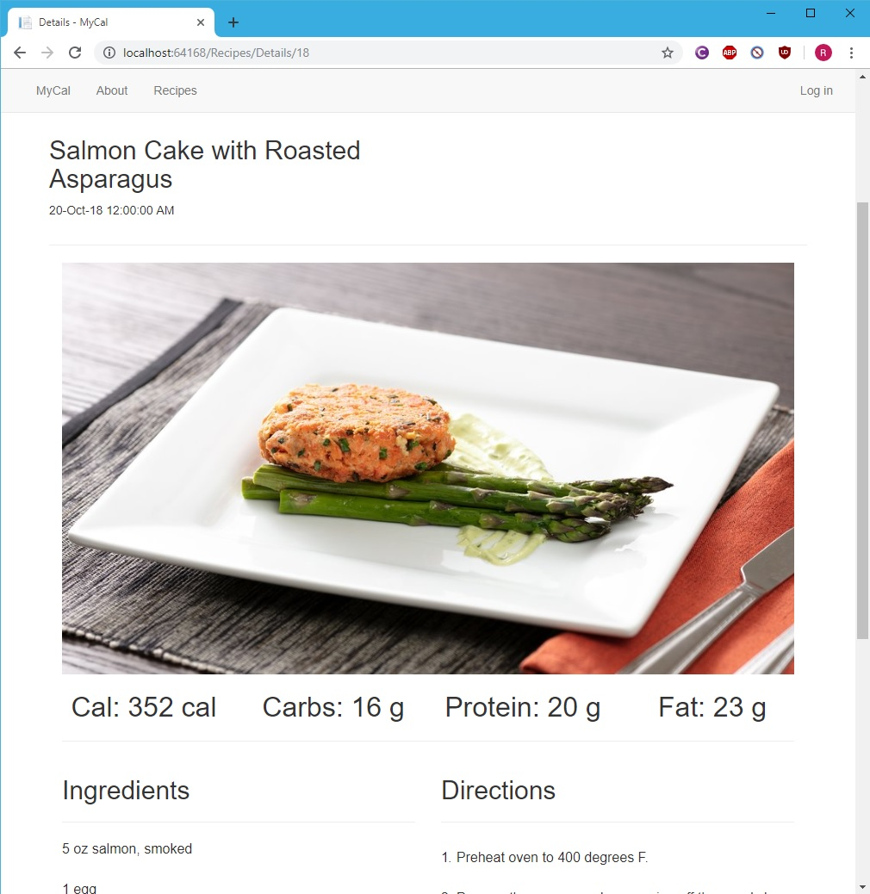
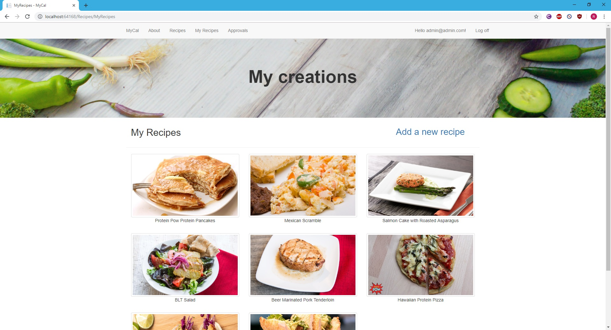
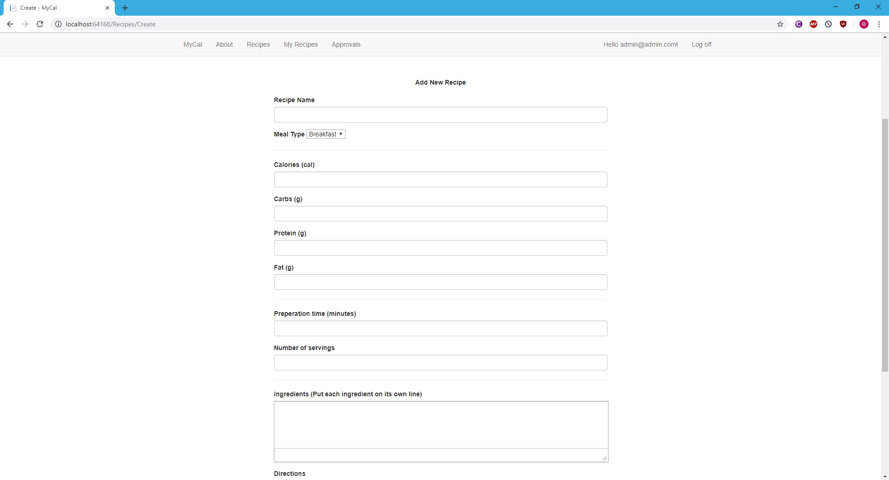
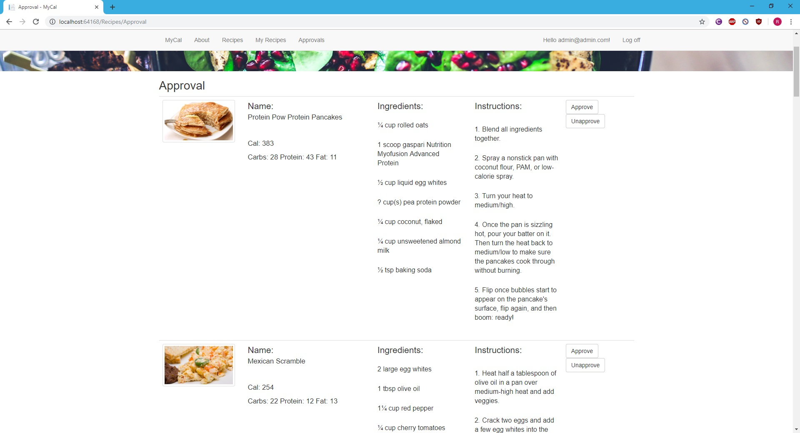

# MyCal

MyCal was the first web application I ever created, it allows users to calculate their daily intake based on their age, gender, height and weight. The calculator uses Mifflin-St Jeor’s equation to calculate 5 different recommended daily intake brackets. Users can also create/add food recipes to the database and/or view existing recipes. 

The application was created as part of a university assignment which required students to develop a web application around the topic of health and fitness.

## Technology and knowledge

The web application was built using ASP.Net MVC. Whilst developing the web application, I learnt the basics of HTML, CSS, JavaScript, C#, building responsive application using Bootstrap, creating entity models using the 3 different approaches (database first, model first, code first) and developing in Visual Studio integrated development environment.

## Acknowledgements

The formula used for the calculator was [Mifflin-St Jeor’s equation](https://academic.oup.com/ajcn/article-abstract/51/2/241/4695104).

## Screenshots

###### Home page - Calculator

###### Recipes page - User's can select tab to show only breakfeast, lunch or dinner options

###### User's recipe page - The user can view the recipes they've added.

###### Inputs page - For adding new recipe

###### Approval page - For admin accounts to approve or unapprove recipes added by users

